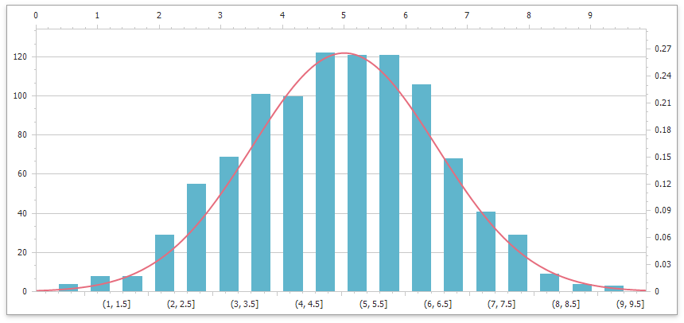

*Files to look at*:
- [Extensions](./CS/WebFormsDashboardCustomPropertiesSample/Content/Extensions)
- [Default.aspx](./CS/WebFormsDashboardCustomPropertiesSample/Default.aspx)

# How to Add a Line Series to a Histogram Chart

The following exaple shows how to add a second series to a Histogram chart:

1. Create histogram and line series and add them to the [ChartControl.Series](https://docs.devexpress.com/WindowsForms/DevExpress.XtraCharts.ChartControl.Series) collection.
2. Use the [Series.DataSource](https://docs.devexpress.com/CoreLibraries/DevExpress.XtraCharts.Series.DataSource) property to bind each series to an individual data source.

## Documentation

- [Histogram](https://docs.devexpress.com/WindowsForms/400824/controls-and-libraries/chart-control/data-representation/histogram)